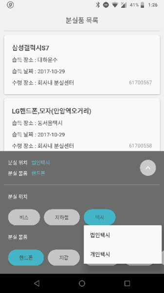
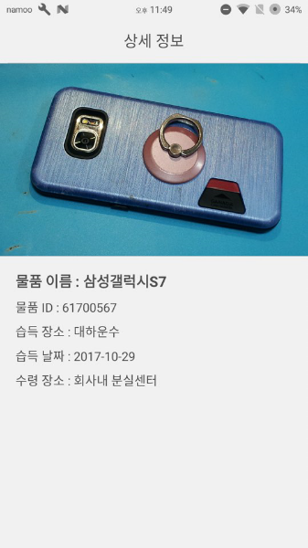

# 너 왜 거기있어

> 2017 서울시 앱공모전 예선 당선작
>
> 서울시 대중교통 분실물 조회 및 검색 애플리케이션

# 팀명

> Coddect
>
> Code로 사람과 세상을 Connect 하다.

# 팀원

> 유용민 (성보고등학교 2016 입학생) - 프로그래밍, 기획
> 
> 김영현 (성보고등학교 2016 입학생) - 프로그래밍, 기획
> 
> 강민서 (경문고등학교 2016 입학생) - 프로그래밍, 디자인

# 개발기간

> 2017년 6월 ~ 2017년 10월

# 스크린샷

> 
>
> 조건(대중교통, 종류 등)에 따른 물품 검색 및 조회

> 
>
> 물품 상세 정보 및 사진 확인

> 
>
> 분실물 관련 정보 확인
