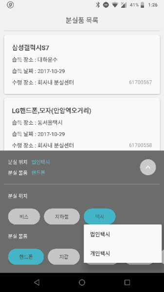
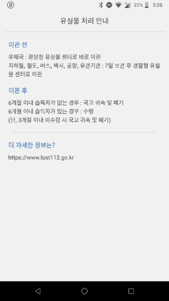

# 너 왜 거기있어 : Why are you Here?

</img>
</img>
</img>

### 2017 서울시 앱공모전 예선 당선작

서울시 대중교통 분실물 목록을 조회하고 검색하는 애플리케이션입니다.

서울시 공공데이터 API를 활용하여 개발되었습니다.

### Coddect : Code로 사람과 세상을 Connect 하다.

* 유용민 (성보고등학교 2016 입학생) - 프로그래밍, 기획
* 김영현 (성보고등학교 2016 입학생) - 프로그래밍, 기획
* 강민서 (경문고등학교 2016 입학생) - 프로그래밍, 디자인

### 개발기간
* 2017. 06. 개발 시작
* 2017. 10. 개발 완료
